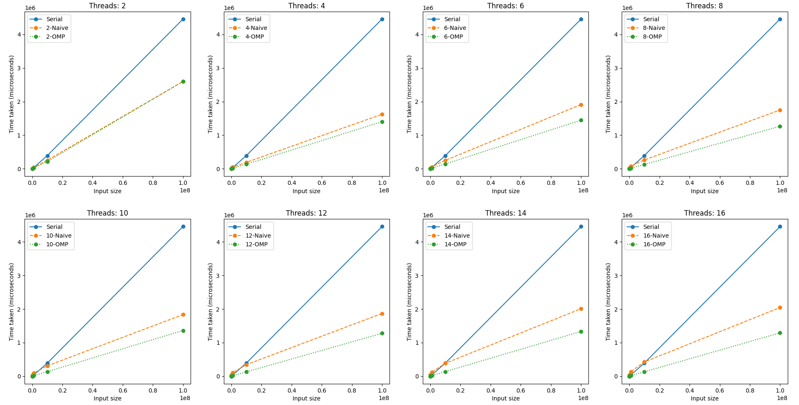

# Parallel Sieve of Eratosthenes

This project provides a parallel implementation of the Sieve of Eratosthenes to find prime numbers, and measure performance gain between serial and parallel algorithms.

## Serial algorithm

```
sieve_of_eratosthenes(A):
    for i = 2 to sqrt(A.size):
        if A[i] is not marked:
            for j = i*i to A.size - 1 in steps of i:
                mark A[j]
    num_primes = 0
    foreach i in A:
        if i is not marked:
            num_primes = num_primes + 1
    return num_primes
```

### Running time analysis:

1. Computing square root of n takes lg(n) time.
2. For every new prime `i`, its multiples are marked in `O(n/i)` steps.
3. Finding all primes take `n/2 + n/3 + n/5 + ... = O(nlg(lg(n)))` time. (proof: [Sum of Reciprocals of Primes is Divergent](https://proofwiki.org/wiki/Sum_of_Reciprocals_of_Primes_is_Divergent))
4. Counting all the primes take linear time.
5. Total time taken `= O(lg(n) + nlg(lg(n)) + n) = O(nlg(lg(n)))`

## Parallel algorithm

```
Parameters
    Assuming SIMD CREW shared memory architecture
    N processors numbered 0 to N-1
    A is a boolean array initialzed with false
    |A| = n, indexed 0 to n-1
    N << sqrt(n) => processor 0 gets all numbers upto sqrt(n)

Algorithm for parallel sieve of Eratosthenes
    for p = 0 to N-1 do in parallel:
        lb[p]: lower bound of processor p on A = p*n/N
        ub[p]: upper bound of processor p on A = ((p+1)*n/N)-1
        Each processor gets at least n/N numbers
        lb[0] = 2, ub[N-1] = n-1
    for i = 2 to sqrt(n):
        if A[i] is marked:
            continue
        for p = 0 to N-1 do in parallel:
            k = max(i*i, lb[p])
            r = k mod i
            if r != 0:
                k = k + i - r
            for j = k to ub[p] in steps of i:
                mark A[j]
    Let prime_count = 0 be a variable with atomic increment
    for p = 0 to N-1 do in parallel:
        for i = lb[p] to ub[p]:
            if A[i] == false:
                prime_count++
    return prime_count
```

### Running time analysis

There are two implementations of the parallel algorithm - naive approach and OpenMP optimization.

**For naive implementation:**

1. `N < sqrt(n)` is the number of processors
2. Computing square root of `n` takes `lg(n)` time
3. Each processor has to mark multiples of a prime in its assigned range of size `n/N`.
4. Marking multiples in parallel takes `O(n/N lg(lg(n/N)))` time.
5. Each processor counts the number of primes in its assigned range in `O(n/N)` time.
6. `N < sqrt(n) => n/N > sqrt(n) > lg(n)`
7. Total time `= O(lg(n) + n/N*lg(lg(n/N)) + n/N) = O(n/N*lg(lg(n/N)))`

**For optimized implementation:**

1. Only major change in the algorithm is in how the processor bounds are computed.
2. For any prime `i`, the range to be traversed is `[i*i, n)`. Out of this, every `i`-th element is checked.
3. Total numbers checked = `(n-i^2)/i`
4. This is divided among N processors as `(n-i^2)/i * 1/N = o(n/N*lg(lg(n/N)))`

## Performance

_The time is measured in microseconds._

<table cellspacing="0" border="0">
	<colgroup width="74"></colgroup>
	<colgroup span="17" width="64"></colgroup>
	<tr>
		<td rowspan=3 height="60" align="center" valign=bottom><b>Input size</b></td>
		<td rowspan=3 align="center" valign=bottom><b>Serial</b></td>
		<td colspan=16 align="center" valign=bottom><b>Parallel</b></td>
		</tr>
	<tr>
		<td colspan=2 align="center" valign=bottom><b>2 Threads</b></td>
		<td colspan=2 align="center" valign=bottom><b>4 Threads</b></td>
		<td colspan=2 align="center" valign=bottom><b>6 Threads</b></td>
		<td colspan=2 align="center" valign=bottom><b>8 Threads</b></td>
		<td colspan=2 align="center" valign=bottom><b>10 Threads</b></td>
		<td colspan=2 align="center" valign=bottom><b>12 Threads</b></td>
		<td colspan=2 align="center" valign=bottom><b>14 Threads</b></td>
		<td colspan=2 align="center" valign=bottom><b>16 Threads</b></td>
		</tr>
	<tr>
		<td align="left" valign=bottom><b>Naive</b></td>
		<td align="left" valign=bottom><b>OMP</b></td>
		<td align="left" valign=bottom><b>Naive</b></td>
		<td align="left" valign=bottom><b>OMP</b></td>
		<td align="left" valign=bottom><b>Naive</b></td>
		<td align="left" valign=bottom><b>OMP</b></td>
		<td align="left" valign=bottom><b>Naive</b></td>
		<td align="left" valign=bottom><b>OMP</b></td>
		<td align="left" valign=bottom><b>Naive</b></td>
		<td align="left" valign=bottom><b>OMP</b></td>
		<td align="left" valign=bottom><b>Naive</b></td>
		<td align="left" valign=bottom><b>OMP</b></td>
		<td align="left" valign=bottom><b>Naive</b></td>
		<td align="left" valign=bottom><b>OMP</b></td>
		<td align="left" valign=bottom><b>Naive</b></td>
		<td align="left" valign=bottom><b>OMP</b></td>
	</tr>
	<tr>
		<td height="20" align="right" valign=bottom sdval="10000" sdnum="1033;">10000</td>
		<td align="right" valign=bottom sdval="0" sdnum="1033;">0</td>
		<td align="right" valign=bottom sdval="4001" sdnum="1033;">4001</td>
		<td align="right" valign=bottom sdval="997" sdnum="1033;">997</td>
		<td align="right" valign=bottom sdval="6964" sdnum="1033;">6964</td>
		<td align="right" valign=bottom sdval="999" sdnum="1033;">999</td>
		<td align="right" valign=bottom sdval="8001" sdnum="1033;">8001</td>
		<td align="right" valign=bottom sdval="1000" sdnum="1033;">1000</td>
		<td align="right" valign=bottom sdval="12001" sdnum="1033;">12001</td>
		<td align="right" valign=bottom sdval="3012" sdnum="1033;">3012</td>
		<td align="right" valign=bottom sdval="13997" sdnum="1033;">13997</td>
		<td align="right" valign=bottom sdval="1001" sdnum="1033;">1001</td>
		<td align="right" valign=bottom sdval="18999" sdnum="1033;">18999</td>
		<td align="right" valign=bottom sdval="1975" sdnum="1033;">1975</td>
		<td align="right" valign=bottom sdval="18001" sdnum="1033;">18001</td>
		<td align="right" valign=bottom sdval="4014" sdnum="1033;">4014</td>
		<td align="right" valign=bottom sdval="19999" sdnum="1033;">19999</td>
		<td align="right" valign=bottom sdval="1998" sdnum="1033;">1998</td>
	</tr>
	<tr>
		<td height="20" align="right" valign=bottom sdval="100000" sdnum="1033;">100000</td>
		<td align="right" valign=bottom sdval="2999" sdnum="1033;">2999</td>
		<td align="right" valign=bottom sdval="7997" sdnum="1033;">7997</td>
		<td align="right" valign=bottom sdval="4001" sdnum="1033;">4001</td>
		<td align="right" valign=bottom sdval="13998" sdnum="1033;">13998</td>
		<td align="right" valign=bottom sdval="4001" sdnum="1033;">4001</td>
		<td align="right" valign=bottom sdval="20999" sdnum="1033;">20999</td>
		<td align="right" valign=bottom sdval="3999" sdnum="1033;">3999</td>
		<td align="right" valign=bottom sdval="26999" sdnum="1033;">26999</td>
		<td align="right" valign=bottom sdval="2999" sdnum="1033;">2999</td>
		<td align="right" valign=bottom sdval="37002" sdnum="1033;">37002</td>
		<td align="right" valign=bottom sdval="4998" sdnum="1033;">4998</td>
		<td align="right" valign=bottom sdval="37000" sdnum="1033;">37000</td>
		<td align="right" valign=bottom sdval="3998" sdnum="1033;">3998</td>
		<td align="right" valign=bottom sdval="46999" sdnum="1033;">46999</td>
		<td align="right" valign=bottom sdval="5001" sdnum="1033;">5001</td>
		<td align="right" valign=bottom sdval="52999" sdnum="1033;">52999</td>
		<td align="right" valign=bottom sdval="4999" sdnum="1033;">4999</td>
	</tr>
	<tr>
		<td height="20" align="right" valign=bottom sdval="1000000" sdnum="1033;">1000000</td>
		<td align="right" valign=bottom sdval="37998" sdnum="1033;">37998</td>
		<td align="right" valign=bottom sdval="39999" sdnum="1033;">39999</td>
		<td align="right" valign=bottom sdval="26998" sdnum="1033;">26998</td>
		<td align="right" valign=bottom sdval="49999" sdnum="1033;">49999</td>
		<td align="right" valign=bottom sdval="15997" sdnum="1033;">15997</td>
		<td align="right" valign=bottom sdval="59999" sdnum="1033;">59999</td>
		<td align="right" valign=bottom sdval="18999" sdnum="1033;">18999</td>
		<td align="right" valign=bottom sdval="86000" sdnum="1033;">86000</td>
		<td align="right" valign=bottom sdval="22998" sdnum="1033;">22998</td>
		<td align="right" valign=bottom sdval="89998" sdnum="1033;">89998</td>
		<td align="right" valign=bottom sdval="19000" sdnum="1033;">19000</td>
		<td align="right" valign=bottom sdval="109999" sdnum="1033;">109999</td>
		<td align="right" valign=bottom sdval="36000" sdnum="1033;">36000</td>
		<td align="right" valign=bottom sdval="122997" sdnum="1033;">122997</td>
		<td align="right" valign=bottom sdval="20000" sdnum="1033;">20000</td>
		<td align="right" valign=bottom sdval="141999" sdnum="1033;">141999</td>
		<td align="right" valign=bottom sdval="21000" sdnum="1033;">21000</td>
	</tr>
	<tr>
		<td height="20" align="right" valign=bottom sdval="10000000" sdnum="1033;">10000000</td>
		<td align="right" valign=bottom sdval="396027" sdnum="1033;">396027</td>
		<td align="right" valign=bottom sdval="255006" sdnum="1033;">255006</td>
		<td align="right" valign=bottom sdval="218990" sdnum="1033;">218990</td>
		<td align="right" valign=bottom sdval="224000" sdnum="1033;">224000</td>
		<td align="right" valign=bottom sdval="179001" sdnum="1033;">179001</td>
		<td align="right" valign=bottom sdval="301998" sdnum="1033;">301998</td>
		<td align="right" valign=bottom sdval="164999" sdnum="1033;">164999</td>
		<td align="right" valign=bottom sdval="312998" sdnum="1033;">312998</td>
		<td align="right" valign=bottom sdval="137999" sdnum="1033;">137999</td>
		<td align="right" valign=bottom sdval="315998" sdnum="1033;">315998</td>
		<td align="right" valign=bottom sdval="151999" sdnum="1033;">151999</td>
		<td align="right" valign=bottom sdval="377996" sdnum="1033;">377996</td>
		<td align="right" valign=bottom sdval="137000" sdnum="1033;">137000</td>
		<td align="right" valign=bottom sdval="480998" sdnum="1033;">480998</td>
		<td align="right" valign=bottom sdval="151998" sdnum="1033;">151998</td>
		<td align="right" valign=bottom sdval="501999" sdnum="1033;">501999</td>
		<td align="right" valign=bottom sdval="138999" sdnum="1033;">138999</td>
	</tr>
	<tr>
		<td height="20" align="right" valign=bottom sdval="100000000" sdnum="1033;">100000000</td>
		<td align="right" valign=bottom sdval="4671996" sdnum="1033;">4671996</td>
		<td align="right" valign=bottom sdval="2543834" sdnum="1033;">2543834</td>
		<td align="right" valign=bottom sdval="2300033" sdnum="1033;">2300033</td>
		<td align="right" valign=bottom sdval="1476962" sdnum="1033;">1476962</td>
		<td align="right" valign=bottom sdval="1271997" sdnum="1033;">1271997</td>
		<td align="right" valign=bottom sdval="1743997" sdnum="1033;">1743997</td>
		<td align="right" valign=bottom sdval="1452998" sdnum="1033;">1452998</td>
		<td align="right" valign=bottom sdval="1722997" sdnum="1033;">1722997</td>
		<td align="right" valign=bottom sdval="1269996" sdnum="1033;">1269996</td>
		<td align="right" valign=bottom sdval="1819999" sdnum="1033;">1819999</td>
		<td align="right" valign=bottom sdval="1375000" sdnum="1033;">1375000</td>
		<td align="right" valign=bottom sdval="1905997" sdnum="1033;">1905997</td>
		<td align="right" valign=bottom sdval="1284997" sdnum="1033;">1284997</td>
		<td align="right" valign=bottom sdval="2005997" sdnum="1033;">2005997</td>
		<td align="right" valign=bottom sdval="1350993" sdnum="1033;">1350993</td>
		<td align="right" valign=bottom sdval="2231001" sdnum="1033;">2231001</td>
		<td align="right" valign=bottom sdval="1554991" sdnum="1033;">1554991</td>
	</tr>
</table>

<br>



## Build instructions

Requirements:

* C++17 or newer
* OpenMP
* Python 3.7+
* Matplotlib for Python
* Pandas for Python

To compile the C++ files:
```
g++ -std=c++17 main.cpp libs/csvwriter/CsvWriter.cpp -o bin/app.exe -fopenmp -Ilibs
```

To run and generate performance data:
```
bin/app.exe
```

To generate the graph:
```
python graph.py
```
